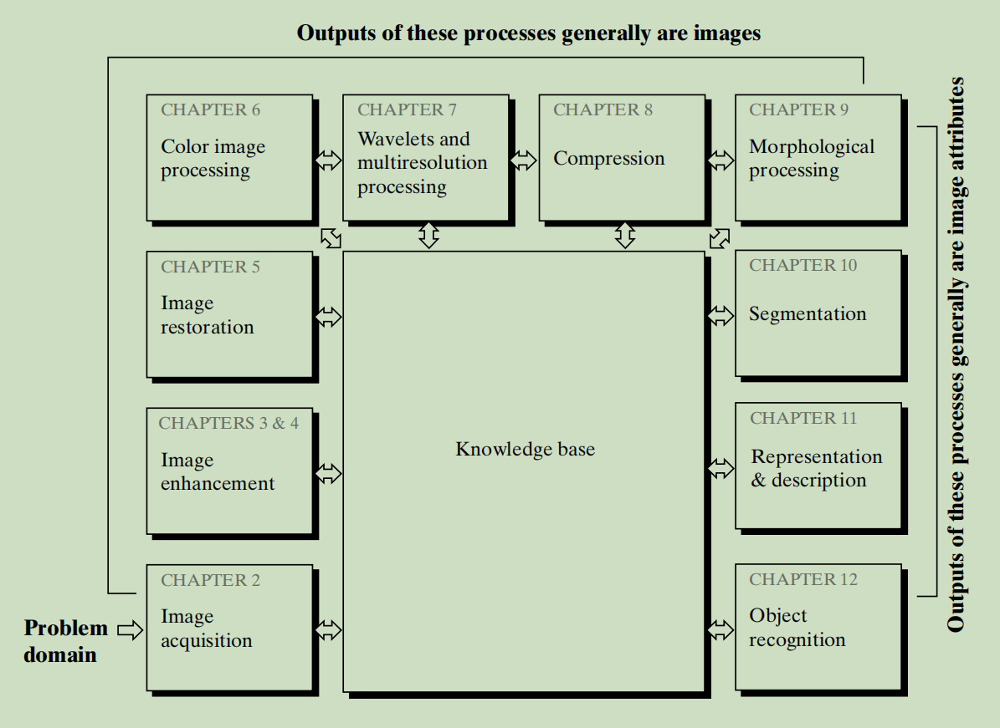

# 1 Introduction

## Preview

Interest in digital image processing methods stems from two principal application areas: **improvement of pictorial information for human interpretation**; and **processing of image data for storage, transmission, and representation for autonomous machine perception**.

This chapter has several objectives：

1. define the scope of the field that we call image processing

## 1.1 What Is Digital Image Processing

An image may be defined as a two-dimensional function, $f(x, y)$, where $x$ and $y$ are *spatial* (plane) coordinates, and the amplitude of $f$ at any pair of coordinates $(x, y)$​ is called the *intensity* or *gray level* of the image at that point. When $x, y$, and the amplitude values of $f$ are all finite, discrete quantities, we call the image a **digital image**. each value of $f$​ is  referred to as picture elements, image elements and **pixels**. The field of **digital image processing** refers to processing digital images by means of a digital computer.

one useful paradigm is to consider three types of computerized processes:

1. Low-level processes involve primitive operations such as image preprocessing to reduce noise, contrast enhancement, and image sharpening. A low-level process is characterized by the fact that both its inputs and outputs are images.
2. Mid-level processing on images involves tasks such as segmentation (partitioning an image into regions or objects), description of those objects to reduce them to a form suitable for computer processing, and classification (recognition) of individual objects. A mid-level process is characterized by the fact that its inputs generally are images, but its outputs are attributes extracted from those images (e.g., edges, contours, and the identity of individual objects).
3. Higher-level processing involves “making sense” of an ensemble of recognized objects, as in image analysis, performing the cognitive functions normally associated with vision.

## 1.2 Fundamental Steps in Digital Image Processing

The digital image processing method can be divided into two categories:

- Methods whose input and output are images
- Methods whose inputs may be images, but whose outputs are attributes extracted from those images.

This organization is summarized as follow

